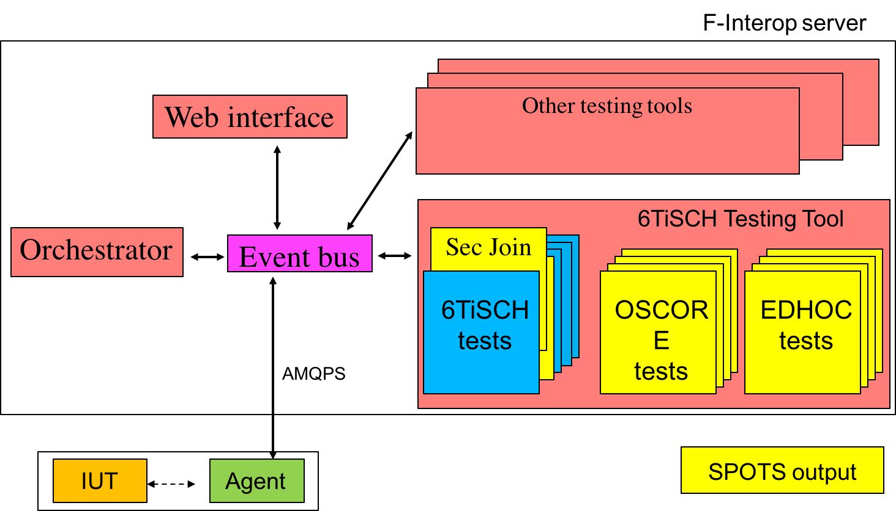
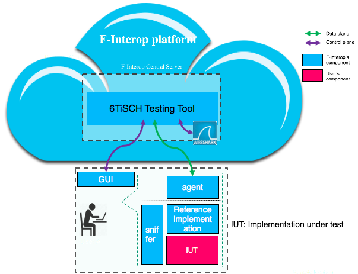

# Test Description of OSCORE

[//]: # (use Pandoc : pandoc spec.md -o spec.html)

## Table of Contents
0. [Glossary](#glossary)
1. [Introduction](#intro)
2. [Overview of OSCORE](#oscore)
3. [Testing with F-Interop Platform](#finterop)
4. [The Test Description Proforma](#proforma)
5. [Conventions](#conventions)
6. [Test Configuration](#config)
    1. [Implementation Under Test](#iut)
    2. [System Under Test](#sut)
    3. [Security Context A: Client](#client-sec)
    4. [Security Context B: Server](#server-sec)
    5. [Resources](#resources)
7. [Environment Setup Tests](#env-setup)
    1. [Test 0](#test-0)
8. [Correct OSCORE Use Tests](#correct-oscore)
    1. [GET test](#get)
        1. [Test 1](#test-1)
        2. [Test 2](#test-2)
        3. [Test 3](#test-3)
        4. [Test 4](#test-4)
        5. [Test 5](#test-5)
    2. [POST test](#post)
        1. [Test 6](#test-6)
    3. [PUT test](#put)       
        1. [Test 7](#test-7)
        3. [Test 8](#test-8)
    4. [DELETE test](#del)
        1. [Test 9](#test-9)
9. [Incorrect OSCORE Use Tests](#incorrect-oscore)
    1. [Security Context not matching](#sec-context)
        1. [Test 10](#test-10)
        3. [Test 11](#test-11)
        5. [Test 12](#test-12)
    2. [Replay of a previously sent message](#replay)
        1. [Test 13](#test-13)
    3. [Accessing a non-OSCORE-protected resource with OSCORE](#auth)
        1. [Test 14](#test-14)
    4. [Accessing an OSCORE-protected resource without OSCORE](#unauth)
        1. [Test 15](#test-15)

## Glossary {#glossary}

* OSCORE: Object Security for Constrained RESTful Environments. See [Overview of OSCORE](#oscore).
* Stimulus: Type of a test step. See [The Test Description Proforma](#proforma).
* Configure: Type of a test step. See [The Test Description Proforma](#proforma).
* Check: Type of a test step. See [The Test Description Proforma](#proforma).
* IUT: Implementation Under Test. See [Test Configuration](#config).
* SUT: System Under Test. See [Test Configuration](#config).

## 1. Introduction {#intro}

This test description (TD) facilitates automated, remote testing of [OSCORE](https://tools.ietf.org/html/draft-ietf-core-object-security-07) as enabled by the [SPOTS](http://spots.ac.me) and [F-Interop](http://www.f-interop.eu) projects.

The TD follows the structure used for previous OSCORE interop events but the test cases have been redesigned to enable automated test execution based on F-Interop 6TiSCH testing tool and Wireshark.

University of Montenegro reserves the right to update the TD as tests are implemented in the F-Interop 6TiSCH testing tool. 
An up to date version of the TD can be found at: [https://github.com/malishav/TD-OSCORE](https://github.com/malishav/TD-OSCORE).

## 2. Overview of OSCORE {#oscore}

Object Security for Constrained RESTful Environments (OSCORE) is a mechanism to secure Constrained Application Protocol (CoAP).
Its distinguishing feature is that it provides end-to-end security in all scenarios where CoAP can be used, including communication through CoAP proxies, CoAP-to-HTTP proxies, and group communication (specified in a companion document).
Note how this contrasts (D)TLS-secured CoAP that only supports basic client-server exchanges with no intermediary proxies.

OSCORE assumes the existence of a security context shared between the client and the server.
How this context is established is considered out-of-scope and happens either out-of-band or through a separate protocol such as [EDHOC](https://tools.ietf.org/html/draft-selander-ace-cose-ecdhe-07) or [DTLS handshake](https://tools.ietf.org/html/rfc6347).
The context, among other parameters, contains security keys used to encrypt (resp. decrypt) outgoing (resp. incoming) messages.

OSCORE takes an unsecured CoAP message as its input and transforms it into an 'OSCORE message'.
OSCORE message complies with the base CoAP header format but its contents is encrypted and integrity protected.
For example, a GET request protected with OSCORE appears on the wire as a generic POST request.
Once the server receives and processes the request with OSCORE, it recognizes it as a GET, from where on CoAP processing takes place.
To test OSCORE processing, one needs to check that the OSCORE implementation generates correct on-the-wire format, as well as that it correctly decrypts and composes an underlying CoAP message.
Responses are cryptographically bound to requests, and both are protected against replay attacks.
For details on OSCORE processing, the reader is referred to the latest [technical specification](https://tools.ietf.org/html/draft-ietf-core-object-security-07).

## 3. Testing with F-Interop Platform {#finterop}

The tests described in this document will be implemented as part of the [F-Interop](http://www.f-interop.eu) platform.
More specifically, SPOTS complements the 6TiSCH Testing Tool of F-Interop.
This is illustrated in the following figure.

6TiSCH Testing Tool connects to the AMQP bus provided by the Orchestrator component and implements the [F-Interop API](http://doc.f-interop.eu/).
To allow the user to run a SPOTS test from an F-Interop GUI session, 6TiSCH Testing Tool interacts with the GUI through AMQP messages conformant to the F-Interop API.
The GUI is agnostic of different testing tools available as part of F-Interop and simply renders the messages received, shifting the test logic and workflow completely to the testing tool.

For example, to allow the user to select a 6TiSCH Secure Join test from the list of tests available as part of the 6TiSCH Testing Tool, an AMQP message sent by the testing tool simply needs to be complemented with an additional map entry containing label "TD\_6TiSCH\_SECJOIN\_01" and a default value triggering the corresponding test.
The GUI component renders the drop-down menu in the web interface and publishes back the user selection, used by the testing tool to launch a specific test.

The figure above illustrates in more details how the actual testing with 6TiSCH Testing Tool is performed.

The 6TiSCH Agent programs one of user devices to act as a sniffer node and transfer to the F-Interop Cloud the actual packets exchanged over the air in user's physical vicinity.
Another user device is programmed as a reference implementation, with the image of the reference implementation being provided by F-Interop.
Finally, the user provides an Implementation Under Test (IUT) that runs on another device and communicates with the reference implementation over the air, as instructed by the Agent.

The 6TiSCH Testing tool expects the sniffed packets sent by the Agent, and runs tests against them.
Internally, the 6TiSCH Testing Tool uses Wireshark to dissect the packets and verify conformance of different fields, as specified in indvidual test cases of this test description.

## 4. The Test Description Proforma {#proforma}

The test descriptions are provided in proforma tables, which include the different steps of the Test Sequence.
The steps can be of different types, depending on their purpose:

* A *stimulus* corresponds to an event that triggers a specific protocol action on an Implementation Under Test (IUT), such as sending a message.

* A *configure* corresponds to an action to modify the IUT or System Under Test (SUT) configuration.

* A *check* consists of observing that one IUT behaves as described in the standard: i.e. resource creation, update, deletion, etc.
For each check in the Test Sequence, a result can be recorded.

* The overall *Verdict* is considered "PASS" if and only if all the checks in the sequence are "PASS".

## 5. Conventions {#conventions}

### Constants

Object-Security option is 21 in all the tests.

### Facilitating Debugging

The client and server may optionally display sent and received messages, external_aad and COSE object (before and after compression) to simplify debugging.
How this is done is implementation-specific.

### Test Naming Conventions

The tests in this document are grouped into 3 categories:

* Set-up (SETUP): CoAP environment setup tests.
* Correct use (CORRECTUSE): Tests of correct OSCORE use.
* Incorrect use (INCORRECTUSE): Incorrect OSCORE use, testing error handling.

To identify each test, this TD uses the following naming convention: TD_OSCORE_X_Y.
X denotes the category, Y denotes the unique test identifier within category X.

### Miscellaneous

When non-indicated, CoAP messages can be NON or CON (implementer's choice).
The type of the CoAP message does not influence the corresponding behavior when OSCORE is correcly used.
The type is explicitly defined for incorrect usage tests, where it influences the behavior.

To be able to run Test 14, the implementer must run an OSCORE-unaware server.

## 6. Test Configuration {#config}

### Implementation Under Test {#iut}

In the context of OSCORE, an Implementation Under Test (IUT) implements at least:

* [RFC7252](https://tools.ietf.org/html/rfc7252) (CoAP)
* [draft-ietf-core-object-security](https://tools.ietf.org/html/draft-ietf-core-object-security-07)

### System Under Test {#sut}

The System Under Test (SUT) is composed of two Implementations Under Test (IUTs), one implementing CoAP client and the other implementing CoAP server.
IP connectivity between the client and the server is assumed for the tests to be executed.

### Security Context A: Client {#client-sec}

* Common Context:
    - Master Secret: `01-02-03-04-05-06-07-08-09-0A-0B-0C-0D-0E-0F-10-11-12-13-14-15-16-17-18-19-1A-1B-1C-1D-1E-1F-20-21-22-23`
    - Alg: AES-CCM-16-64-128
    - Context IV: `6B-D5-EF-74-94-47-95-DC-B4-A7-A2-D0-6B`
* Sender Context:
    - Sender Id: `63-6C-69-65-6E-74`
    - Sender Key: `8D-41-3A-D6-59-FA-1C-F0-B0-7C-2F-D9-6A-53-75-C3`
    - Sender Seq Number: 00
    - Sender IV: `6D-D5-8C-18-FD-22-FB-A8-B4-A7-A2-D0-6B` (using Partial IV: 00)
* Recipient Context:
    - Recipient Id: `73-65-72-76-65-72`
    - Recipient Key: `4E-48-F7-CB-DC-2E-71-89-9A-6B-3C-82-13-4F-E5-09`
    - Recipient IV: `6D-D5-9C-11-E6-31-F0-AE-B4-A7-A2-D0-6B` (using Partial IV: 00)

### Security Context B: Server {#server-sec}

* Common Context:
    - Master Secret: `01-02-03-04-05-06-07-08-09-0A-0B-0C-0D-0E-0F-10-11-12-13-14-15-16-17-18-19-1A-1B-1C-1D-1E-1F-20-21-22-23`
    - Alg: AES-CCM-16-64-128
    - Context IV: `6B-D5-EF-74-94-47-95-DC-B4-A7-A2-D0-6B`
* Sender Context:
    - Sender Id: `73-65-72-76-65-72`
    - Sender Key: `4E-48-F7-CB-DC-2E-71-89-9A-6B-3C-82-13-4F-E5-09`
    - Sender Seq Number: 00
    - Sender IV: `6D-D5-9C-11-E6-31-F0-AE-B4-A7-A2-D0-6B` (using Partial IV: 00)
* Recipient Context:
    - Recipient Id: `63-6C-69-65-6E-74`
    - Recipient Key: `8D-41-3A-D6-59-FA-1C-F0-B0-7C-2F-D9-6A-53-75-C3`
    - Recipient IV: `6D-D5-8C-18-FD-22-FB-A8-B4-A7-A2-D0-6B` (using Partial IV: 00)

### Resources

The list of resources the OSCORE-aware server must implement is the following:

* /oscore/hello/coap : authorized method: GET, returns the string `Hello World!` with content-format 0 (text/plain)
* /oscore/hello/1 : protected resource, authorized method: GET, returns the string `Hello World!` with content-format 0 (text/plain)
* /oscore/hello/2 : protected resource, authorized method: GET, returns the string `Hello World!` with content-format 0 (text/plain), and with ETag 0x2b
* /oscore/hello/3 : protected resource, authorized method: GET, returns the string `Hello World!` with content-format 0 (text/plain), and Max-Age 5
* /oscore/hello/6 : protected resource, authorized method: POST, returns the value of the resource with content-format 0 (text/plain)
* /oscore/hello/7 : protected resource, authorized method: PUT, returns the value of the resource with content-format 0 (text/plain), has ETag 0x7b
* /oscore/observe : protected resource, authorized method: GET, returns a counter incremented every 2 seconds, supports observe.
* /oscore/test: protected resource, authorized method: DEL.

The list of resource the OSCORE-unaware server must implement is the following:

* /oscore/hello/coap : authorized method: GET, returns the string "Hello World!" with content-format text/plain

------

## 7. Environment Setup Tests {#env-setup}

### 7.1. Identifier: TD_OSCORE_SETUP_01 {#test-0}

**Objective** : Verify that CoAP exchange works. Perform a simple GET transaction using COAP, Content-Format and Uri-Path option

**Configuration** :

_server resources_:

* /oscore/hello/coap : authorized method: GET, returns the string "Hello World!" with content-format text/plain

**Test Sequence**

+------+----------+----------------------------------------------------------+
| Step | Type     | Description                                              |
+======+==========+==========================================================+
| 1    | Stimulus | The client is requested to send a CoAP GET request to    |
|      |          | the server at Uri-Path /oscore/hello/coap                |
+------+----------+----------------------------------------------------------+
| 2    | Check    | Server receives the request from the client, which is    |
|      |          | decoded as:                                              |
|      |          |                                                          |
|      |          | - Code: GET                                              |
|      |          | - Uri-Path: /oscore/hello/coap                           |
+------+----------+----------------------------------------------------------+
| 3    | Check    | Client receives the response from the server, which is   |
|      |          | decoded as:                                              |
|      |          |                                                          |
|      |          | - Code: 2.05 Content                                     |
|      |          | - Content-Format: text/plain                             |
|      |          | - Payload: `Hello World!`                                |
+------+----------+----------------------------------------------------------+

## 8. Correct OSCORE Use Tests {#correct-oscore}

### 8.1 GET Tests {#get}

#### 8.1.1. Identifier: TD_OSCORE_CORRECTUSE_01 {#test-1}

**Objective** : Perform a simple GET transaction using OSCORE, Content-Format and Uri-Path option

**Configuration** :

_client security context_: [Security Context A](#client-sec), with:

* Sequence number sent not in server's replay window

_server security context_: 
[Security Context B](#server-sec), with:

* Sequence number received not in server's replay window

_server resources_:

* /oscore/hello/1 : protected resource, authorized method: GET, returns the string "Hello World!" with content-format text/plain

**Test Sequence**

+------+----------+----------------------------------------------------------+
| Step | Type     | Description                                              |
+======+==========+==========================================================+
| 1    | Stimulus | The client is requested to send a CoAP GET request to    |
|      |          | the server at Uri-Path /oscore/hello/1, protected with   |
|      |          | OSCORE.                                                  |
+------+----------+----------------------------------------------------------+
| 2    | Check    | Server receives the request from the client, which is    |
|      |          | decoded as:                                              |
|      |          |                                                          |
|      |          | - Code: POST                                             |
|      |          | - Object-Security: non-empty                             |
|      |          | - Payload: ciphertext                                    |
+------+----------+----------------------------------------------------------+
| 3    | Check    | Server decrypts, parses, and processes the request:      |
|      |          |                                                          |
|      |          | - OSCORE verification succeeds                           |
|      |          | - Code: GET                                              |
|      |          | - Uri-Path: /oscore/hello/1                              |
+------+----------+----------------------------------------------------------+
| 4    | Check    | Client receives the response from the server, which is   |
|      |          | decoded as:                                              |
|      |          |                                                          |
|      |          | - Code: 2.04 Changed                                     |
|      |          | - Object-Security: empty                                 |
|      |          | - Payload: ciphertext                                    |
+------+----------+----------------------------------------------------------+
| 5    | Check    | Client decrypts, parses, and processes the response:     |
|      |          |                                                          |
|      |          | - OSCORE verification succeeds                           |
|      |          | - Code: 2.05 Content                                     |
|      |          | - Content-Format: text/plain                             |
|      |          | - Payload: `Hello World!`                                |
+------+----------+----------------------------------------------------------+

#### 8.1.2. Identifier: TD_OSCORE_CORRECTUSE_02 {#test-2}

**Objective** : Perform a GET transaction using OSCORE, Content-Format, Uri-Path, Uri-Query and ETag option

**Configuration** :

_client security context_: [Security Context A](#client-sec), with:

* Sequence number sent not in server's replay window

_server security context_: [Security Context B](#server-sec), with:

* Sequence number received not in server's replay window

_server resources_:

* /oscore/hello/2 : protected resource, authorized method: GET, returns the string "Hello World!" with content-format text/plain, and with ETag 0x2b

**Test Sequence**

+------+----------+----------------------------------------------------------+
| Step | Type     | Description                                              |
+======+==========+==========================================================+
| 1    | Stimulus | The client is requested to send a CoAP GET request to    |
|      |          | the server at Uri-Path /oscore/hello/2 and Uri-Query     |
|      |          | first=1, protected with OSCORE.                          |
+------+----------+----------------------------------------------------------+
| 2    | Check    | Server receives the request from the client, which is    |
|      |          | decoded as:                                              |
|      |          |                                                          |
|      |          | - Code: POST                                             |
|      |          | - Object-Security: non-empty                             |
|      |          | - Payload: ciphertext                                    |
+------+----------+----------------------------------------------------------+
| 3    | Check    | Server decrypts, parses, and processes the request:      |
|      |          |                                                          |
|      |          | - OSCORE verification succeeds                           |
|      |          | - Code: GET                                              |
|      |          | - Uri-Path: /oscore/hello/2                              |
|      |          | - Uri-Query: first=1                                     |
+------+----------+----------------------------------------------------------+
| 4    | Check    | Client receives the response from the server, which is   |
|      |          | decoded as:                                              |
|      |          |                                                          |
|      |          | - Code: 2.04 Changed                                     |
|      |          | - Object-Security: empty                                 |
|      |          | - Payload: ciphertext                                    |
+------+----------+----------------------------------------------------------+
| 5    | Check    | Client decrypts, parses, and processes the response:     |
|      |          |                                                          |
|      |          | - OSCORE verification succeeds                           |
|      |          | - Code: 2.05 Content                                     |
|      |          | - Content-Format: text/plain                             |
|      |          | - ETag: 0x2b                                             |
|      |          | - Payload: `Hello World!`                                |
+------+----------+----------------------------------------------------------+

#### 8.1.3. Identifier: TD_OSCORE_CORRECTUSE_03 {#test-3}

**Objective** : Perform a GET transaction using OSCORE, Content-Format, Uri-Path, Accept and Max-Age option

**Configuration** :

_client security context_: [Security Context A](#client-sec), with:

* Sequence number sent not in server's replay window

_server security context_: [Security Context B](#server-sec), with:

* Sequence number received not in server's replay window

_server resources_:

* /oscore/hello/3 : protected resource, authorized method: GET, returns the string "Hello World!" with content-format text/plain, and Max-Age 5

**Test Sequence**

+------+----------+----------------------------------------------------------+
| Step | Type     | Description                                              |
+======+==========+==========================================================+
| 1    | Stimulus | The client is requested to send a CoAP GET request to    |
|      |          | the server at Uri-Path /oscore/hello/3 with Accept       |
|      |          | option set to text/plain;charset=utf-8, protected with   |
|      |          | OSCORE.                                                  |
+------+----------+----------------------------------------------------------+
| 2    | Check    | Server receives the request from the client, which is    |
|      |          | decoded as:                                              |
|      |          |                                                          |
|      |          | - Code: POST                                             |
|      |          | - Object-Security: non-empty                             |
|      |          | - Payload: ciphertext                                    |
+------+----------+----------------------------------------------------------+
| 3    | Check    | Server decrypts, parses, and processes the request:      |
|      |          |                                                          |
|      |          | - OSCORE verification succeeds                           |
|      |          | - Code: GET                                              |
|      |          | - Uri-Path: /oscore/hello/3                              |
|      |          | - Accept: text/plain;charset=utf-8                       |
+------+----------+----------------------------------------------------------+
| 4    | Check    | Client receives the response from the server, which is   |
|      |          | decoded as:                                              |
|      |          |                                                          |
|      |          | - Code: 2.04 Changed                                     |
|      |          | - Object-Security: empty                                 |
|      |          | - Payload: ciphertext                                    |
+------+----------+----------------------------------------------------------+
| 5    | Check    | Client decrypts, parses, and processes the response:     |
|      |          |                                                          |
|      |          | - OSCORE verification succeeds                           |
|      |          | - Code: 2.05 Content                                     |
|      |          | - Content-Format: text/plain                             |
|      |          | - Max-Age: 05                                            |
|      |          | - Payload: `Hello World!`                                |
+------+----------+----------------------------------------------------------+

#### 8.1.4. Identifier: TD_OSCORE_CORRECTUSE_04 {#test-4}

**Objective** : Perform a GET transaction using OSCORE, Content-Format, Uri-Path, and Observe. Response without observe.

**Configuration** :

_client security context_: [Security Context A](#client-sec), with:

* Sequence number sent not in server's replay window

_server security context_: [Security Context B](#server-sec), with:

* Sequence number received not in server's replay window

_server resources_:

* /oscore/hello/1 : protected resource, authorized method: GET, returns the string "Hello World!" with content-format text/plain

**Test Sequence**

+------+----------+----------------------------------------------------------+
| Step | Type     | Description                                              |
+======+==========+==========================================================+
| 1    | Stimulus | The client is requested to send a CoAP GET request to    |
|      |          | the server at Uri-Path /oscore/hello/1 with Observe      |
|      |          | option registration, protected with OSCORE.              |
+------+----------+----------------------------------------------------------+
| 2    | Check    | Server receives the request from the client, which is    |
|      |          | decoded as:                                              |
|      |          |                                                          |
|      |          | - Code: FETCH                                            |
|      |          | - Observe: Registration                                  |
|      |          | - Object-Security: non-empty                             |
|      |          | - Payload: ciphertext                                    |
+------+----------+----------------------------------------------------------+
| 3    | Check    | Server decrypts, parses, and processes the request:      |
|      |          |                                                          |
|      |          | - OSCORE verification succeeds                           |
|      |          | - Code: GET                                              |
|      |          | - Uri-Path: /oscore/hello/1                              |
|      |          | - Observe: Registration
+------+----------+----------------------------------------------------------+
| 4    | Check    | Client receives the response from the server, which is   |
|      |          | decoded as:                                              |
|      |          |                                                          |
|      |          | - Code: 2.04 Changed                                     |
|      |          | - Object-Security: non-empty                             |
|      |          | - Payload: ciphertext                                    |
+------+----------+----------------------------------------------------------+
| 5    | Check    | Client decrypts, parses, and processes the response:     |
|      |          |                                                          |
|      |          | - OSCORE verification succeeds                           |
|      |          | - Code: 2.05 Content                                     |
|      |          | - Content-Format: text/plain                             |
|      |          | - Payload: `Hello World!`                                |
+------+----------+----------------------------------------------------------+

#### 8.1.5. Identifier: TD_OSCORE_CORRECTUSE_05 {#test-5}

**Objective** : Perform a GET transaction using OSCORE, Content-Format, Uri-Path, and Observe.

**Configuration** :

_client security context_: [Security Context A](#client-sec), with:

* Sequence number sent not in server's replay window
* Sequence number received not in client's replay window

_server security context_: [Security Context B](#server-sec), with:

* Sequence number received not in server's replay window
* Sequence sent received not in client's replay window

_server resources_:

* /oscore/observe : protected resource, authorized method: GET, returns a counter incremented every 2 seconds, supports observe.

**Test Sequence**

+------+----------+----------------------------------------------------------+
| Step | Type     | Description                                              |
+======+==========+==========================================================+
| 1    | Stimulus | The client is requested to send a CoAP GET request to    |
|      |          | the server at Uri-Path /oscore/observe with Observe      |
|      |          | option registration, protected with OSCORE.              |
+------+----------+----------------------------------------------------------+
| 2    | Check    | Server receives the request from the client, which is    |
|      |          | decoded as:                                              |
|      |          |                                                          |
|      |          | - Code: FETCH                                            |
|      |          | - Observe: Registration                                  |
|      |          | - Object-Security: non-empty                             |
|      |          | - Payload: ciphertext                                    |
+------+----------+----------------------------------------------------------+
| 3    | Check    | Server decrypts, parses, and processes the request:      |
|      |          |                                                          |
|      |          | - OSCORE verification succeeds                           |
|      |          | - Code: GET                                              |
|      |          | - Uri-Path: /oscore/observe                              |
|      |          | - Observe: Registration                                  |
+------+----------+----------------------------------------------------------+
| 4    | Check    | Client receives the response from the server, which is   |
|      |          | decoded as:                                              |
|      |          |                                                          |
|      |          | - Code: 2.05 Content                                     |
|      |          | - Observe: Notification                                  |
|      |          | - Object-Security: non-empty                             |
|      |          | - Payload: ciphertext                                    |
+------+----------+----------------------------------------------------------+
| 5    | Check    | Client decrypts, parses, and processes the request:      |
|      |          |                                                          |
|      |          | - OSCORE verification succeeds                           |
|      |          | - Code: 2.05 Content                                     |
|      |          | - Observe: Notification                                  |
|      |          | - Content-Format: text/plain                             |
|      |          | - Payload: arbitrary                                     |
+------+----------+----------------------------------------------------------+
| 6    | Check    | Client receives the response from the server, which is   |
|      |          | decoded as:                                              |
|      |          |                                                          |
|      |          | - Code: 2.05 Content                                     |
|      |          | - Observe: Notification                                  |
|      |          | - Object-Security: non-empty                             |
|      |          | - Payload: ciphertext                                    |
+------+----------+----------------------------------------------------------+
| 7    | Check    | Client decrypts, parses, and processes the request:      |
|      |          |                                                          |
|      |          | - OSCORE verification succeeds                           |
|      |          | - Code: 2.05 Content                                     |
|      |          | - Observe: Notification                                  |
|      |          | - Content-Format: text/plain                             |
|      |          | - Payload: arbitrary                                     |
+------+----------+----------------------------------------------------------+

### 8.2. POST Tests {#post}

#### 8.2.1. Identifier: TD_OSCORE_CORRECTUSE_06 {#test-6}

**Objective** : Perform a POST transaction using OSCORE, Content-Format, and Uri-Path option, changing a resource.

**Configuration** :

_client security context_: [Security Context A](#client-sec), with:

* Sequence number sent not in server's replay window

_server security context_: [Security Context B](#server-sec), with:

* Sequence number received not in server's replay window

_server resources_:

* /hello/6  : protected resource, authorized method: POST, returns the value of the resource with content-format text/plain

**Test Sequence**

+------+----------+----------------------------------------------------------+
| Step | Type     | Description                                              |
+======+==========+==========================================================+
| 1    | Stimulus | The client is requested to send a CoAP POST request to   |
|      |          | the server at Uri-Path /oscore/hello/6 with Content      |
|      |          | Format set to text/plain and payload 0x4a, protected     |
|      |          | with OSCORE.                                             |
+------+----------+----------------------------------------------------------+
| 2    | Check    | Server receives the request from the client, which is    |
|      |          | decoded as:                                              |
|      |          |                                                          |
|      |          | - Code: POST                                             |
|      |          | - Object-Security option                                 |
|      |          | - Payload: ciphertext                                    |
+------+----------+----------------------------------------------------------+
| 3    | Check    | Server decrypts, parses, and processes the request:      |
|      |          |                                                          |
|      |          | - OSCORE verification succeeds                           |
|      |          | - Code: POST                                             |
|      |          | - Uri-Path: /oscore/hello/6                              |
|      |          | - Content-Format: text/plain                             |
|      |          | - Payload: 0x4a                                          |
+------+----------+----------------------------------------------------------+
| 4    | Check    | Client receives the response from the server, which is   |
|      |          | decoded as:                                              |
|      |          |                                                          |
|      |          | - Code: 2.04 Changed                                     |
|      |          | - Content-Format: text/plain                             |
|      |          | - Payload: ciphertext                                    |
+------+----------+----------------------------------------------------------+
| 5    | Check    | Client decrypts, parses, and processes the response:     |
|      |          |                                                          |
|      |          | - OSCORE verification succeeds                           |
|      |          | - Code: 2.04 Changed                                     |
|      |          | - Content-Format: text/plain                             |
|      |          | - Payload: 0x4a                                          |
+------+----------+----------------------------------------------------------+

### 8.3 PUT Tests {#PUT}

#### 8.3.1. Identifier: TD_OSCORE_CORRECTUSE_07 {#test-7}

**Objective** : Perform a PUT transaction using OSCORE, Uri-Path, Content-Format and If-Match option.

**Configuration** :

_client security context_: [Security Context A](#client-sec), with:

* Sequence number sent not in server's replay window

_server security context_: [Security Context B](#server-sec), with:

* Sequence number received not in server's replay window

_server resources_:

* /hello/7  : protected resource, authorized method: PUT, returns the value of the resource with content-format text/plain, has ETag 0x7b

**Test Sequence**

+------+----------+----------------------------------------------------------+
| Step | Type     | Description                                              |
+======+==========+==========================================================+
| 1    | Stimulus | The client is requested to send a CoAP PUT request to    |
|      |          | the server at Uri-Path /oscore/hello/7 with Content      |
|      |          | Format set to text/plain, If-Match set to 0x7b, payload  |
|      |          | set to 0x7a, protected with OSCORE.                      |
+------+----------+----------------------------------------------------------+
| 2    | Check    | Server receives the request from the client, which is    |
|      |          | decoded as:                                              |
|      |          |                                                          |
|      |          | - Code: POST                                             |
|      |          | - Object-Security: non-empty                             |
|      |          | - Payload: ciphertext                                    |
+------+----------+----------------------------------------------------------+
| 3    | Check    | Server decrypts, parses, and processes the request:      |
|      |          |                                                          |
|      |          | - OSCORE verification succeeds                           |
|      |          | - Code: PUT                                              |
|      |          | - Uri-Path: /oscore/hello/7                              |
|      |          | - Content-Format: text/plain                             |
|      |          | - If-Match: 0x7b                                         |
|      |          | - Payload: 0x7a                                          |
+------+----------+----------------------------------------------------------+
| 4    | Check    | Client receives the response from the server, which is   |
|      |          | decoded as:                                              |
|      |          |                                                          |
|      |          | - Code: 2.04 Changed                                     |
|      |          | - Object-Security: non-empty                             |
|      |          | - Payload: ciphertext                                    |
+------+----------+----------------------------------------------------------+
| 5    | Check    | Client decrypts, parses, and processes the response:     |
|      |          |                                                          |
|      |          | - OSCORE verification succeeds                           |
|      |          | - Code: 2.04 Changed                                     |
|      |          | - Content-Format: text/plain                             |
|      |          | - Payload: 0x7a                                          |
+------+----------+----------------------------------------------------------+

#### 8.3.2. Identifier: TD_OSCORE_CORRECTUSE_08 {#test-8}

**Objective** : Perform a PUT transaction using OSCORE, Uri-Path, Content-Format and If-None-Match option.

**Configuration** :

_client security context_: [Security Context A](#client-sec), with:

* Sequence number sent not in server's replay window

_server security context_: [Security Context B](#server-sec), with:

* Sequence number received not in server's replay window

_server resources_:

* /oscore/hello/7 : protected resource, authorized method: PUT, returns the value of the resource with content-format text/plain, has ETag 0x7b

**Test Sequence**

+------+----------+----------------------------------------------------------+
| Step | Type     | Description                                              |
+======+==========+==========================================================+
| 1    | Stimulus | The client is requested to send a CoAP PUT request to    |
|      |          | the server at Uri-Path /oscore/hello/7 with Content      |
|      |          | Format set to text/plain, If-None-Match option present   |
|      |          | and payload set to 0x8a, protected with OSCORE.          |
+------+----------+----------------------------------------------------------+
| 2    | Check    | Server receives the request from the client, which is    |
|      |          | decoded as:                                              |
|      |          |                                                          |
|      |          | - Code: POST                                             |
|      |          | - Object-Security: non-empty                             |
|      |          | - Payload: ciphertext                                    |
+------+----------+----------------------------------------------------------+
| 3    | Check    | Server decrypts, parses, and processes the request:      |
|      |          |                                                          |
|      |          | - OSCORE verification succeeds                           |
|      |          | - Code: PUT                                              |
|      |          | - Uri-Path: /oscore/hello/7                              |
|      |          | - Content-Format: text/plain                             |
|      |          | - If-None-Match: empty                                   |
|      |          | - Payload: 0x8a                                          |
+------+----------+----------------------------------------------------------+
| 4    | Check    | Client receives the response from the server, which is   |
|      |          | decoded as:                                              |
|      |          |                                                          |
|      |          | - Code: 2.04 Changed                                     |
|      |          | - Object-Security: non-empty                             |
|      |          | - Payload: ciphertext                                    |
+------+----------+----------------------------------------------------------+
| 5    | Check    | Client decrypts, parses, and processes the response:     |
|      |          |                                                          |
|      |          | - OSCORE verification succeeds                           |
|      |          | - Code: 4.12 Precondition Failed                         |
+------+----------+----------------------------------------------------------+

### 8.4. DELETE Tests {#DEL}

#### 8.4.1. Identifier: TD_OSCORE_CORRECTUSE_09 {#test-9}

**Objective** : Perform a DELETE transaction using OSCORE and Uri-Path option.

**Configuration** :

_client security context_: [Security Context A](#client-sec), with:

* Sequence number sent not in server's replay window

_server security context_: [Security Context B](#server-sec), with:

* Sequence number received not in server's replay window

_server resources_:

* /oscore/test: protected resource, authorized method: DEL.

**Test Sequence**

+------+----------+----------------------------------------------------------+
| Step | Type     | Description                                              |
+======+==========+==========================================================+
| 1    | Stimulus | The client is requested to send a CoAP DEL request to    |
|      |          | the server at Uri-Path /oscore/test, protected with      |
|      |          | OSCORE.                                                  |
+------+----------+----------------------------------------------------------+
| 2    | Check    | Server receives the request from the client, which is    |
|      |          | decoded as:                                              |
|      |          |                                                          |
|      |          | - Code: POST                                             |
|      |          | - Object-Security: non-empty                             |
|      |          | - Payload: ciphertext                                    |
+------+----------+----------------------------------------------------------+
| 3    | Check    | Server decrypts, parses, and processes the request:      |
|      |          |                                                          |
|      |          | - OSCORE verification succeeds                           |
|      |          | - Code: DEL                                              |
|      |          | - Uri-Path: /oscore/test                                 |
+------+----------+----------------------------------------------------------+
| 4    | Check    | Client receives the response from the server, which is   |
|      |          | decoded as:                                              |
|      |          |                                                          |
|      |          | - Code: 2.04 Changed                                     |
|      |          | - Object-Security: non-empty                             |
|      |          | - Payload: ciphertext                                    |
+------+----------+----------------------------------------------------------+
| 5    | Check    | Client decrypts, parses, and processes the response:     |
|      |          |                                                          |
|      |          | - OSCORE verification succeeds                           |
|      |          | - Code: 2.02 Deleted                                     |
+------+----------+----------------------------------------------------------+

## 9. Incorrect OSCORE use {#incorrect-oscore}

### 9.1. Security Context not matching {#sec-context}

#### 9.1.1. Identifier: TD_OSCORE_INCORRECTUSE_01 {#test-10}

**Objective** : Perform an unauthorized CON GET transaction: non matching Client Sender Id - Server Recipient Id.

**Configuration** :

_client security context_: [Security Context A](#client-sec), with:

* Sender Context:
    - Sender ID: modified sender ID (arbitrarily set by the Client)

_server security context_: [Security Context B](#server-sec)

_server resources_:

* /oscore/hello/1 : protected resource, authorized method: GET, returns the string "Hello World!" with content-format text/plain

**Test Sequence**

+------+----------+----------------------------------------------------------+
| Step | Type     | Description                                              |
+======+==========+==========================================================+
| 1    | Stimulus | The client is requested to send a CoAP CON GET request to|
|      |          | the server at Uri-Path /oscore/hello/1, protected with   |
|      |          | OSCORE.                                                  |
+------+----------+----------------------------------------------------------+
| 2    | Check    | Server receives the request from the client, which is    |
|      |          | decoded as:                                              |
|      |          |                                                          |
|      |          | - Code: POST                                             |
|      |          | - Object-Security: non-empty                             |
|      |          | - Payload: ciphertext                                    |
+------+----------+----------------------------------------------------------+
| 3    | Check    | Server decrypts, parses, and processes the request:      |
|      |          |                                                          |
|      |          | - OSCORE verification fails (Context not found)          |
+------+----------+----------------------------------------------------------+
| 4    | Check    | Client receives the response from the server, which is   |
|      |          | decoded as:                                              |
|      |          |                                                          |
|      |          | - Code: 4.01 Unauthorized                                |
|      |          | - Max-Age: 0                                             |
|      |          | - Payload: `Security context not found` (optional)       |
+------+----------+----------------------------------------------------------+

#### 9.1.2. Identifier: TD_OSCORE_INCORRECTUSE_02 {#test-11}

**Objective** : Perform a CON GET transaction with non matching Client Sender - Server Recipient Keys.

**Configuration** :

_client security context_: [Security Context A](#client-sec), with:

* Sender Context:
    - Sender Key: modified key (arbitrarily set by the Client)

_server security context_: [Security Context B](#server-sec)

_server resources_:

* /oscore/hello/1 : protected resource, authorized method: GET, returns the string "Hello World!" with content-format text/plain

**Test Sequence**

+------+----------+----------------------------------------------------------+
| Step | Type     | Description                                              |
+======+==========+==========================================================+
| 1    | Stimulus | The client is requested to send a CoAP CON GET request to|
|      |          | the server at Uri-Path /oscore/hello/1, protected with   |
|      |          | OSCORE.                                                  |
+------+----------+----------------------------------------------------------+
| 2    | Check    | Server receives the request from the client, which is    |
|      |          | decoded as:                                              |
|      |          |                                                          |
|      |          | - Code: POST                                             |
|      |          | - Object-Security: non-empty                             |
|      |          | - Payload: ciphertext                                    |
+------+----------+----------------------------------------------------------+
| 3    | Check    | Server decrypts, parses, and processes the request:      |
|      |          |                                                          |
|      |          | - OSCORE verification fails (Decryption failed)          |
+------+----------+----------------------------------------------------------+
| 4    | Check    | Client receives the response from the server, which is   |
|      |          | decoded as:                                              |
|      |          |                                                          |
|      |          | - Code: 4.00 Bad Request                                 |
|      |          | - Max-Age: 0                                             |
|      |          | - Payload: `Decryption failed` (optional)                |
+------+----------+----------------------------------------------------------+

#### 9.1.3. Identifier: TD_OSCORE_INCORRECTUSE_03 {#test-12}

**Objective** : Perform a CON GET transaction with non matching Client Recipient - Server Sender Keys.

**Configuration** :

_client security context_: [Security Context A](#client-sec), with:

* Recipient Context:
    - Recipient Key: modified key (arbitrarily set by the Client)

_server security context_: [Security Context B](#server-sec)

_server resources_:

* /oscore/hello/1 : protected resource, authorized method: GET, returns the string "Hello World!" with content-format text/plain

**Test Sequence**

+------+----------+----------------------------------------------------------+
| Step | Type     | Description                                              |
+======+==========+==========================================================+
| 1    | Stimulus | The client is requested to send a CoAP CON GET request to|
|      |          | the server at Uri-Path /oscore/hello/1, protected with   |
|      |          | OSCORE.                                                  |
+------+----------+----------------------------------------------------------+
| 2    | Check    | Server receives the request from the client, which is    |
|      |          | decoded as:                                              |
|      |          |                                                          |
|      |          | - Code: POST                                             |
|      |          | - Object-Security: non-empty                             |
|      |          | - Payload: ciphertext                                    |
+------+----------+----------------------------------------------------------+
| 3    | Check    | Server decrypts, parses, and processes the request:      |
|      |          |                                                          |
|      |          | - OSCORE verification succeeds                           |
|      |          | - Code: GET                                              |
|      |          | - Uri-Path: /oscore/hello/1                              |
+------+----------+----------------------------------------------------------+
| 4    | Check    | Client receives the response from the server, which is   |
|      |          | decoded as:                                              |
|      |          |                                                          |
|      |          | - Code: 2.04 Changed                                     |
|      |          | - Object-Security: non-empty                             |
|      |          | - Payload: ciphertext                                    |
+------+----------+----------------------------------------------------------+
| 5    | Check    | Client decrypts, parses, and processes the request:      |
|      |          |                                                          |
|      |          | - OSCORE verification fails (Decryption failed)          |
+------+----------+----------------------------------------------------------+

### 9.2. Replay of a previously sent message {#replay}

#### 9.2.1. Identifier: TD_OSCORE_INCORRECTUSE_04 {#test-13}

**Objective** : Perform a CON GET transaction using OSCORE, Content-Format and Uri-Path option, request replayed by the Client.

**Configuration** :

_client security context_: [Security Context A](#client-sec), with:

* Sequence number sent *IN* server's replay window

_server security context_: [Security Context B](#server-sec), with:

* Sequence number received *IN* server's replay window

_server resources_:

* /oscore/hello/1 : protected resource, authorized method: GET, returns the string "Hello World!" with content-format text/plain

**Test Sequence**

+------+----------+----------------------------------------------------------+
| Step | Type     | Description                                              |
+======+==========+==========================================================+
| 1    | Stimulus | The client is requested to send a CoAP CON GET request to|
|      |          | the server at Uri-Path /oscore/hello/1, protected with   |
|      |          | OSCORE.                                                  |
+------+----------+----------------------------------------------------------+
| 2    | Check    | Server receives the request from the client, which is    |
|      |          | decoded as:                                              |
|      |          |                                                          |
|      |          | - Code: POST                                             |
|      |          | - Object-Security: non-empty                             |
|      |          | - Payload: ciphertext                                    |
+------+----------+----------------------------------------------------------+
| 3    | Check    | Server decrypts, parses, and processes the request:      |
|      |          |                                                          |
|      |          | - OSCORE verification fails (Replay protection failed)   |
+------+----------+----------------------------------------------------------+
| 4    | Check    | Client receives the response from the server, which is   |
|      |          | decoded as:                                              |
|      |          |                                                          |
|      |          | - Code: 4.01 Unauthorized                                |
|      |          | - Max-Age: 0                                             |
|      |          | - Payload: `Replay protection failed` (optional)         |
+------+----------+----------------------------------------------------------+

### 9.3. Accessing a non-OSCORE-protected resource with OSCORE {#auth}

#### 9.3.1. Identifier: TD_OSCORE_INCORRECTUSE_05 {#test-14}

**Objective** : Perform a CON GET transaction using OSCORE to an OSCORE-unaware resource server, Content-Format and Uri-Path option.

**Configuration** :

_client security context_: [Security Context A](#client-sec)

The server does *not* implement OSCORE.

_server security context_: None

_server resources_:

* /oscore/hello/coap : authorized method: GET, returns the string "Hello World!" with content-format text/plain

**Test Sequence**

+------+----------+----------------------------------------------------------+
| Step | Type     | Description                                              |
+======+==========+==========================================================+
| 1    | Stimulus | The client is requested to send a CoAP CON GET request to|
|      |          | the server at Uri-Path /oscore/hello/coap, protected with|
|      |          | OSCORE.                                                  |
+------+----------+----------------------------------------------------------+
| 2    | Check    | Server receives the request from the client, which is    |
|      |          | decoded as:                                              |
|      |          |                                                          |
|      |          | - Code: POST                                             |
|      |          | - Object-Security: non-empty                             |
|      |          | - Payload: ciphertext                                    |
+------+----------+----------------------------------------------------------+
| 3    | Check    | Server decrypts, parses, and processes the request:      |
|      |          |                                                          |
|      |          | - OSCORE verification succeeds                           |
|      |          | - Code: GET                                              |
|      |          | - Uri-Path: /oscore/hello/coap                           |
+------+----------+----------------------------------------------------------+
| 4    | Check    | Client receives the response from the server, which is   |
|      |          | decoded as:                                              |
|      |          |                                                          |
|      |          | - Code: 4.02 Bad Option                                  |
|      |          | - Max-Age: 0                                             |
|      |          | - Payload: arbitrary (optional)                          |
+------+----------+----------------------------------------------------------+

### 9.4. Accessing an OSCORE-protected resource without OSCORE {#unauth}

#### 9.4.1. Identifier: TD_OSCORE_INCORRECTUSE_06 {#test-15}

**Objective** : Perform a CON GET transaction to a protected resource, Content-Format and Uri-Path option.

**Configuration** :

No client-side OSCORE configuration present.

_server security context_: [Security Context B](#server-sec)

_server resources_:

* /oscore/hello/1 : protected resource, authorized method: GET, returns the string "Hello World!" with content-format text/plain

**Test Sequence**

+------+----------+----------------------------------------------------------+
| Step | Type     | Description                                              |
+======+==========+==========================================================+
| 1    | Stimulus | The client is requested to send a CoAP CON GET request to|
|      |          | the server at Uri-Path /oscore/hello/1.                  |
+------+----------+----------------------------------------------------------+
| 2    | Check    | Server receives the request from the client, which is    |
|      |          | decoded as:                                              |
|      |          |                                                          |
|      |          | - Code: GET                                              |
|      |          | - Uri-Path: /oscore/hello/1                              |
+------+----------+----------------------------------------------------------+
| 3    | Check    | Client receives the response from the server, which is   |
|      |          | decoded as:                                              |
|      |          |                                                          |
|      |          | - Code: 4.01 Unauthorized                                |
|      |          | - Payload: arbitrary (optional)                          |
+------+----------+----------------------------------------------------------+

